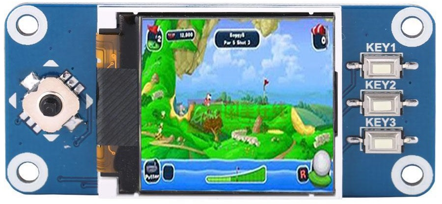

 
This cute little (1.44 in display) controller is available on ebay for $12: <a href="https://www.ebay.com/itm/1-44inch-LCD-Display-HAT-SPI-for-Raspberry-Pi-2B-3B-Zero-Zero-W-ST7735S-Driver/153197894200?_trkparms=aid%3D555018%26algo%3DPL.SIM%26ao%3D1%26asc%3D20131003132420%26meid%3D7442a26741e84797b6a7974ce7759da1%26pid%3D100005%26rk%3D3%26rkt%3D12%26sd%3D152882960316%26itm%3D153197894200&_trksid=p2047675.c100005.m1851">here</a>, and is perfect for a $10 pi zero (available at adafruit.com).  
 To create an sd card for this device, follow these steps: 

  <ul>
  <li>Obtain the latest raspbian image from <a href="https://www.raspberrypi.org/downloads/raspbian/">https://www.raspberrypi.org/downloads/raspbian/</a></li>
  <li>Place the raspbian .img file on a 8gb (or larger) sd card (I use <a href="https://sourceforge.net/projects/win32diskimager/files/latest/download">win32diskimager</a> for this)</li>
  <li>Place all the files and directories from this repository on the sd card (this will be considered the /boot directory on the pi).  Any windows machine can be used for this as the sd card has a small amount of space which is windows compatible.</li>
  <li>Bootup the raspberry pi, open a line terminal and execute these commands:
  
  <pre>
  sudo bash
  cd /boot
  chmod 777 all.sh
  ./all.sh
  </pre>
  
  </li>
  <li>reboot the raspberry pi</li>
  <li>Open a line terminal and run the python examples by typing python filename.py</li>
  </ul>

<h2>Description of .sh files</h2>
<table border="2px">
<tr><th>Name</th><th>Description</th></tr>
<tr><td>all.sh</td><td>Run all the .sh files.  Check that user is super user and parameter contains gmail info</td></tr>
<tr><td>ap.sh</td><td>(No longer used because pi should be connected to home router) Create an acccess point with SSID="vehicle1" and password="ABCD1234"</td></tr>
<tr><td>crontab.sh</td><td>Setup the crontab which can run a task every minute</td></tr>
<tr><td>keyboard.sh</td><td>Configure the usb keyboard for US keys</td></tr>
<tr><td>ssh.sh</td><td>Setup the pi for ssh access</td></tr>
<tr><td>timezone.sh</td><td>Set the pi's current timezone to match the user's locations</td></tr>
</table>  

<h2>Description of examples</h2>
<table border="2px">
<tr><th>Name</th><th>Description</th></tr>
<tr><td>b</td><td>A functioning watch, use top button to set hours, middle to set minutes, and bottom button to set seconds</td></tr>
<tr><td>buttonLineDraw (main.py)</td><td>Draw lines and show images based on button presses (pong and tic-tac-toe static screens)</td></tr>
<tr><td>displayButtons(main.py)</td><td>Show images on screen bassed on button presses</td></tr>
</table> 
email:paulware@hotmail.com  